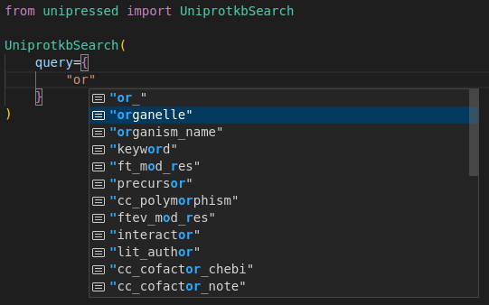
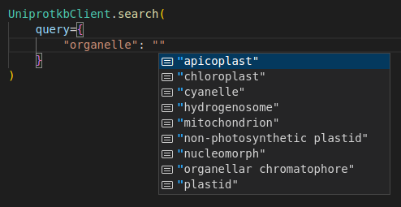
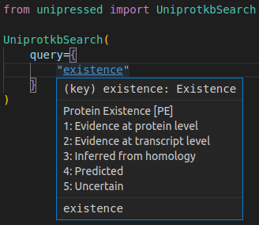

---
hide:
  - navigation
---


## Screenshots

<figure markdown>
{ width="400" }
<figcaption> Autocompletion for query keys</figcaption>
</figure>

<figure markdown>
{ width="400" }
<figcaption> Autocompletion for query values</figcaption>
</figure>

<figure markdown>
{ width="400" }
<figcaption>Documentation for almost all types</figcaption>
</figure>

<figure markdown>
{ width="400" }
<figcaption> Autocompletion for return fields</figcaption>
</figure>

## API

::: unipressed.dataset.core.UniprotDataset
    options:
        show_bases: False

::: unipressed.dataset.core.FetchManyDataset

::: unipressed.dataset.search.Search
    options:
        show_bases: False
        members:
            - each_response
            - each_page
            - each_record

::: unipressed.IdMappingRequest

::: unipressed.id_mapping.core.IdMappingJob

::: unipressed.id_mapping.core.IdMappingResult

::: unipressed.Arba
    options:
        members: None

::: unipressed.Citations
    options:
        members: None

::: unipressed.Diseases
    options:
        members: None

::: unipressed.Keywords
    options:
        members: None

::: unipressed.Locations
    options:
        members: None

::: unipressed.Proteomes
    options:
        members: None

::: unipressed.Taxonomy
    options:
        members: None

::: unipressed.Uniparc
    options:
        members: None

::: unipressed.Uniprotkb
    options:
        members: None

::: unipressed.Uniref
    options:
        members: None

::: unipressed.Unirule
    options:
        members: None

